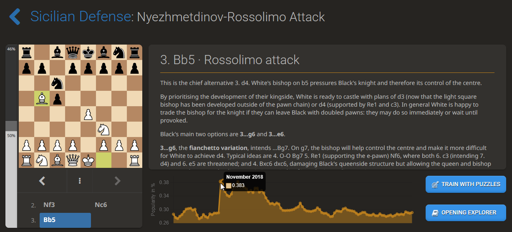
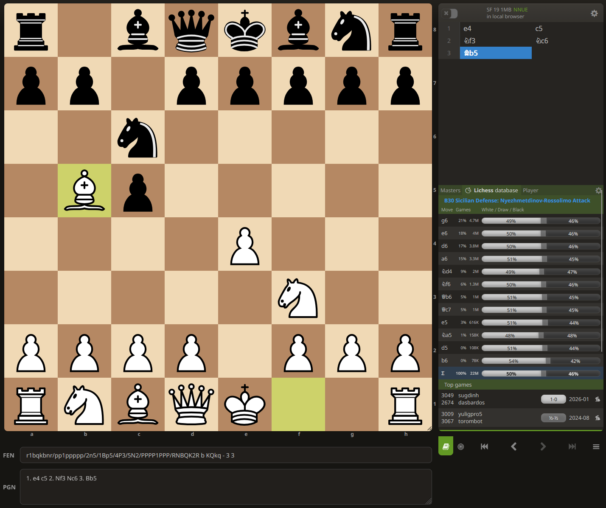
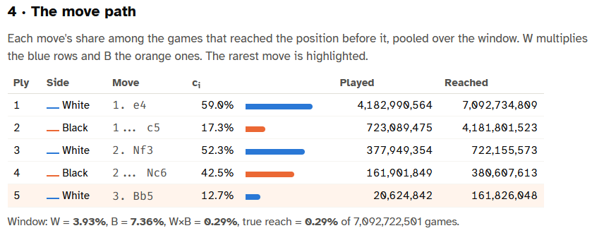
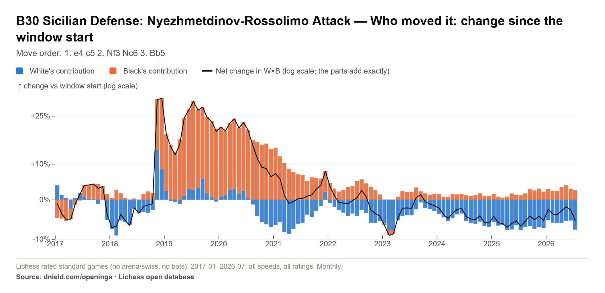

# What happened to the Rossolimo?

In November 2018, the Lichess Openings Explorer shows that the Rossolimo had a sudden surge in popularity, growing from occurring in 0.291% of games in October to 0.383% of games in November, a small (0.092%) increase in nominal terms, but a huge jump (31%!) in relative terms. Given the suddenness of the spike after over a year of stability, then a gradual decline back to its normal 0.3% levels over the next few years, it's extremely unlikely that this was just random noise.

Followers of competitive chess might notice right away that this was the month that the 2018 World Chess Championship started, featuring Fabiano Caruana as the challenger to Magnus Carlsen, and the obvious reason for this sudden spike in the Rossolimo's popularity was due to the fact that the Rossolimo featured prominently in this title match, with Caruana choosing 1. e4 for all of the non-tie break games in the match, and Magnus choosing the Sicilian, intending to play the Sveshnikov in the Open Sicilian, during all of these games.

It seems likely the competitive chess watchers following the match decided to pick up and try using the openings being used in the most watched match of the year, being played between the world #1 and #2 at the time, both rated over 2800 and only 3 rating points separating them at the time of the match.

But here's an interesting question: was this increase in popularity driven by White players switching to the Rossolimo? or by Black players switching to the Nc6 Sicilian? Or both?

You could answer this by just checking and recording the popularity of each of the prior positions in the path to the Rossolimo, and seeing whether we see this same graph shape in each of them. We do, but the relative change gets bigger the deeper into the opening you go:

| Position | Before (Oct 2018) | After (Nov 2018) | Relative change |
|:---|---:|---:|---:|
| 1. e4 | 57.8% | 58.3% | +0.9% |
| 1. e4 c5 | 11.354% | 11.843% | +4.3% |
| 1. e4 c5 2. Nf3 | 6.172% | 6.542% | +6.0% |
| 1. e4 c5 2. Nf3 Nc6 | 2.31% | 2.649% | +14.7% |
| 1. e4 c5 2. Nf3 Nc6 3. Bb5 (the Rossolimo) | 0.291% | 0.383% | +31.6% |

The changes in 1. e4's and 1... c5's popularity are indiscernible from random noise in the graph, but the changes compound with each additional move.

But yes, just from the changes in the popularity of 2... Nc6 and 3. Bb5 you can reasonably infer that the aggregate popularity of the Rossolimo was probably driven by some combination of White players giving 3. Bb5 a try, and Black players giving Nc6 Sicilian a try. But then, how do you quantify the relative impact? And which color is the subsequent falloff in popularity attributable to? Checking the graphs of all of these positions in order to answer these kinds of questions is kind of a pain in the butt...

Which leads me to my point: the issue with "opening explorers" is that they don't really give you statistics about the **opening**, they give you statistics about a **position**. For example, the graph above shows what percentage of games reach a position, and the table below shows how many games reached it over the selected time span, how often the player to move (White, in this case) plays each legal move from it, and the score rate for the position and for each move.

# What an opening explorer should be able to tell you

1\. How often **you** would get to play the opening, if it was in your repertoire,

2\. How opponents would see the opening when facing players other than you,

3\. Is the increase or decline in the popularity of an opening being driven by one color not playing as often? or because the other color isn't giving them the chance to play it as often?

These are all the types of questions that chess opening data nerds like me would want to know, and they're super simple to calculate/answer given the data within these tables, but it requires you to record the sequence of probabilities, not just the probabilities you see in the current position.

Let's take question 1: if we wanted to calculate how often we would get to play the Rossolimo as White, all we need to do is take the probability that Black plays 1... c5 when faced with 1. e4 (which is 17.3% across all Lichess rated standard games, excluding arena and swiss tournaments and bots) and multiply that by the probability that Black plays 2... Nc6 after we play 2. Nf3 (which is 42.5%). 17.3% x 42.5% = 7.4% probability that White gets to play the Rossolimo in any given game. That's **way** higher than the 0.383% probability we saw earlier, right? That's because we take **our moves as given**, we don't need to include the probability that **we** will play 1. e4, 2. Nf3, or 3. Bb5 in the calculation because we **know** we will play them.

Answering question 2 means doing the exact opposite: given that our opponent plays the Nc6 Sicilian, the probability that they would face the Rossolimo means multiplying the probability that their opponent will play 1. e4 (59%), will respond to their 1... c5 move with 2. Nf3 (52.3%), and then respond to their 2... Nc6 move with 3. Bb5 (12.7%), for a final probability of 3.9%.

One fun corollary of the answers to questions 1 and 2 is that, with these probabilities, you can then calculate how much more experience in the opening than you will have than your opponent by simply taking the ratio of the percentage of the time you get to play it over the probability of the time they will face it, so White Rossolimo players will have 7.4% / 3.9% = 1.9x as much experience in Rossolimo positions as their opponents will.

Finally, these two probabilities also helps us answer our third question, because we can now attribute the change in the popularity of the position to each color, because the popularity of a position is simply the product of these two probabilities, and by decomposing it into these two numbers, we can precisely calculate how much of the percentage change is due to changes in what White plays when given the chance versus changes in what Black plays when given the chance.

Any math nerds might notice that all of these calculations are all just products, i.e. the probability of the Rossolimo is P(1.e4) x P(1... c5) x P(2.Nf3) x P(2... Nc6) x P(3. Bb5), and the cool thing about products – okay, maybe only cool if you're a math nerd – is that you can take their log, so that these probabilities become additive, meaning that when we take that Lichess opening popularity graph and put it on the log scale, we can also graph the net contribution of White and Black to that popularity. This sets up something like a nice "waterfall" plot, where, when both White and Black play the prerequisite moves for an opening more or they both play it less, then the position popularity's net change line on a log scale will rest on top of (or at the bottom of) the relative changes in these question #1 and question #2 probabilities, and if they pull in opposite directions, the position's net change in popularity line will be based on just the difference between the two contributions.

# So, which color really drove the Rossolimo's surge, and subsequent decline, in popularity?

If we just choose a starting point to index the change to, we can create a plot like the one below, which shows the change in the popularity of the Rossolimo in relative terms to its popularity in January 2017 and provides a clean answer to our question, and quantifies what we had to look at multiple Lichess opening explorer graphs to see earlier: the Rossolimo indeed got about 30% more popular on November 2018, and it was, initially, due to both White **and** Black playing it when they had the chance. However, the increased popularity among White players was relatively short-lived, with White playing the Rossolimo no more frequently (in terms of % of games that they play it when given the opportunity) than in January 2017 by just two months later. Almost all of the residual increase in popularity of the Rossolimo is attributable to Black players playing 1... c5 and 2... Nc6 more frequently during 2019-2020 than they had in 2017-2018, so White players who kept in their repertoire just had more opportunities to use it. This is, perhaps, itself attributable that Magnus Carlsen ended up winning the match, as Caruana was unsuccessful in breaking through Magnus's Sicilian with his Rossolimo, to the point that Caruana ended up switching to the Open Sicilian later in the match.

# Wrapping up

I want to make one thing super clear: this post is not meant to be a criticism of Lichess, the design of its opening explorer, or anything of the sort. The visual simplicity of Lichess's database table is one of its greatest strengths, and adding any of these visualizations/statistics would require adding a substantial amount of visual clutter and significantly complicating their design, for capabilities only a niche set of opening data nerds like me would ever use.

This post, and all of the tools that I've built on the [Openings section of my website](../../openings/index.qmd) (which are interactive and available for free so you can explore these and other stats for any named opening, across any time control, rating bracket, or time period) wouldn't be possible without Lichess making their data freely available to the public. I am eternally grateful for their contributions to the chess data world, with special thanks to Christopher Akiki for his work making Lichess's data even more accessible on Huggingface.

This was just a hobby project of mine to 1. make it easier to answer the types of questions that I like to investigate, 2. see how easy it is to host an interactive dashboard on my personal website, and 3. give me the chance to write about something that I think is cool.

I hope you think it's cool too. Give the [Openings section](../../openings/index.qmd) of my website a whirl. I've added little one-click export "Download" buttons for exporting any visualizations you make as pngs for making it easy to share what you find.