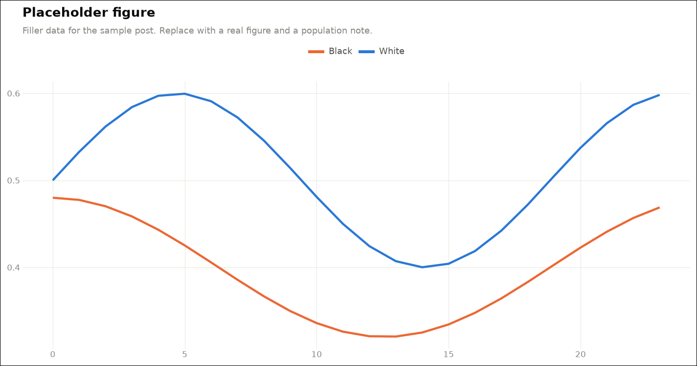

Open with a concrete hook, not a thesis. Lorem ipsum dolor sit amet, consectetur adipiscing elit. Sed do eiusmod tempor incididunt ut labore et dolore magna aliqua. This post will do three things: show one figure, quote one number, and end with an honest caveats section.

# What was measured

Ut enim ad minim veniam, quis nostrud exercitation ullamco laboris. A key number goes in bold, like **1 in 17,700 games**, and carries its provenance: the artifact, the filter and the population.

## A sub-step

Duis aute irure dolor in reprehenderit in voluptate velit esse cillum dolore eu fugiat nulla pariatur. Link generously and credit sources, for example the [opening dashboard](../../openings/index.qmd).

# Why this isn't the whole story

Excepteur sint occaecat cupidatat non proident, sunt in culpa qui officia deserunt mollit anim id est laborum. Say what the data shows and what it does not.

*Method: filler text only. A real post names the corpus, the filter and the game count here, plus the script in `analysis/` that produced each figure.*
